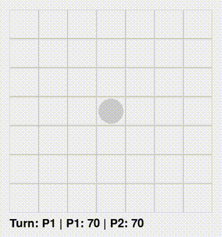

# Mosaic (モザイク) Python版

## 概要

このプロジェクトは、ボードゲーム「Mosaic」のルールをPythonとpygameで再現した（非公式）GUIゲームです。  
exeファイルでの実行も可能です。(bin/main.exe)

元ゲームは、MOSAICの<span style="text-transform:none;">[公式HP](https://mosaic.games/)</span>をご確認ください。


---

## 遊び方

モザイクのゲーム盤には７×７＝４９個の穴が開いており、その中心には中立のコマが最初から固定されています。

２人のプレイヤーはそれぞれ７０個ずつのコマを持ちます。ゲームの進め方は、以下のとおりです。

先手のプレイヤーから、交互に自分のコマを１つずつゲーム盤の空いている穴に置いていきます。
４つのコマが隣り合う最小の正方形の形に並んだら、その上にもコマを置くことができます。
もしも４つのコマが正方形に並んで、しかもその４つの内の３つまたは４つが同じ色で占められていた場合、その上にその色のコマが自動的に（手番とは別に）置かれます。

初めからゲーム盤の中央に固定されているコマは、どちらのプレイヤーのものでもない中立のコマになります。中立のコマを含む正方形ができた時に、その上に自動的にコマが置かれるのは、残りの３つのコマが同じ色だった場合のみです。
自動的にコマが置かれたことで、新しい正方形ができ、その正方形の３つまたは４つが同じ色で占められていた場合、同じように自動的にコマが置かれます。こうして連鎖反応的にコマが積み上がっていきます。積み上がるコマは、手番プレイヤーのコマだけでなく、相手プレイヤーのコマである場合もあります。
こうして交互にコマを置いて行って、先に自分のコマをすべて置き終えた人が勝ちです。

<span style="text-transform:none;">[公式HP](https://mosaic.games/how-to-play/)</span>

---

## 動作環境

- Python 3.7以上  
- pygame 2.0以上推奨

---

## インストール方法

1. リポジトリをクローンまたはダウンロード  
2. 必要なパッケージをインストール  
   ```bash
   pip install pygame
   ```
3. main.py を実行
   ```bash
    python main.py
   ```

## 使い方
マウスクリックで、自分のターンにコマを配置
配置可能なセルのみ選択可能（上層の駒は下層の4マスが埋まっている中央に置ける）
先に自分のコマをすべて置き切ったプレイヤーが勝利

## ファイル構成
main.py : ゲームのエントリーポイント、描画とイベント処理
game_logic.py : ゲームのルールと状態管理のロジック
README.md : 本ファイル

## EXE化
PyInstallerを使ってexe化可能です。
```bash
    pip install pyinstaller
    pyinstaller --onefile --windowed main.py
```

END